# Adebiyi Joseph Ayomide

**Software developer building AI agents, developer tools and web applications.** Also known as [JoeBuildsThings](https://github.com/JoeBuildsThings).

I build with JavaScript and Node.js, focused on AI agents that do real work: reading code, running tasks, searching the web and asking before they change anything. I am a Library and Information Science student at UNIOSUN, and I ship software alongside my studies.

  
  
  

## Tech Stack

  
  
  
  
  
  
  

## Featured Projects

### [JOEBOT](https://github.com/JoeBuildsThings/joebot): terminal AI agent

A terminal AI assistant built on real tool calling, not a chat wrapper.

* Reads files, searches code, runs shell commands and searches the live web.
* Asks for approval before it writes a file or runs a command, with destructive patterns blocked and file access sandboxed.
* Routes across several AI providers and falls back automatically when one runs out of quota.
* Keeps personal memory that you can add to and clear.
* Built with JavaScript, Node.js and an Ink terminal interface.

Status: in active development.

### [GameDeck](https://github.com/JoeBuildsThings/gamedeck): Android performance overlay

A rootless in game performance overlay and optimizer for Android 10 to 14. A floating HUD shows live FPS, frame times, CPU load, RAM and battery thermals, with reversible gaming profiles and a one tap restore.

* Uses Shizuku for privileged actions without root, and hard blocks system packages from ever being touched.
* Built with Kotlin and Jetpack Compose, with Room and DataStore for profiles and activity logs.

### [CGPA Calculator](https://github.com/JoeBuildsThings/cgpa-calculator): GPA tool for UNIOSUN students

Built for UNIOSUN's 5.0 grading scale, not the generic 4.0 most templates assume. Tracks multiple semesters with a running CGPA and saves locally so nothing resets on reload.

### [Vibeo](https://github.com/JoeBuildsThings/Vibeo): social app

A social app that combines Facebook style feeds with WhatsApp style messaging, built with JavaScript.

### [Portfolio website](https://joebuildsthings.netlify.app)

My personal site, built with Astro and Tailwind CSS. [View the source code](https://github.com/JoeBuildsThings/JoeBuildsThings-Portfolio-Website).

## Currently Learning

Cybersecurity fundamentals, self paced, working toward ISC2 CC and CompTIA Security+.

## Open To

Remote roles, freelance projects and collaborations on web applications, AI powered tools and developer focused products. Email is the fastest way to reach me.

## Connect

* Email: [adebiyijosephayomide@gmail.com](mailto:adebiyijosephayomide@gmail.com)
* X: [@Adebiyijoseph_](https://x.com/Adebiyijoseph_)
* Portfolio: [joebuildsthings.netlify.app](https://joebuildsthings.netlify.app)
* Facebook: [Adebiyi Joseph Ayomide](https://www.facebook.com/adebiyi.joseph.ayomide)
* Instagram: [@adebiyijosephayomide](https://www.instagram.com/adebiyijosephayomide)

Building. Learning. Shipping.

